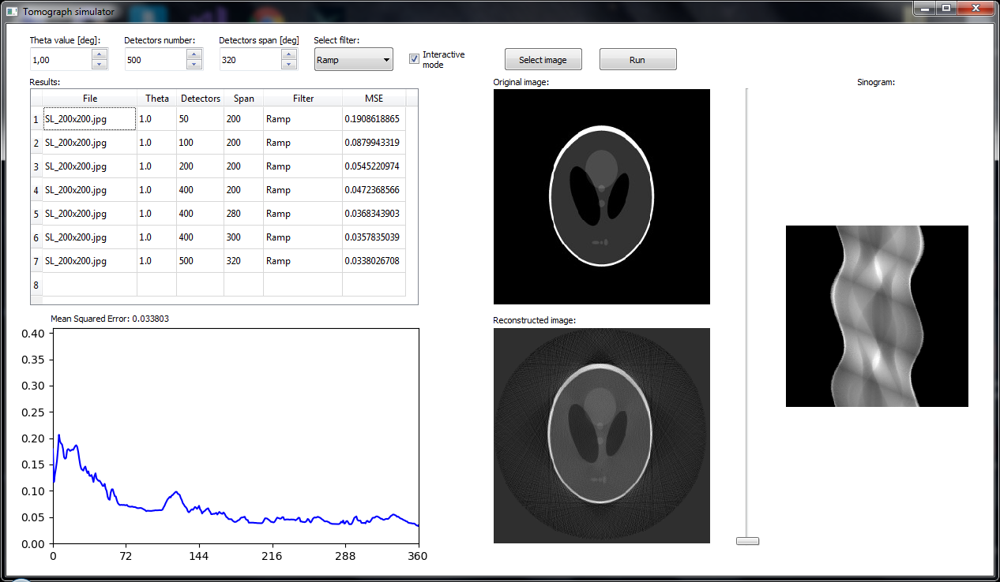
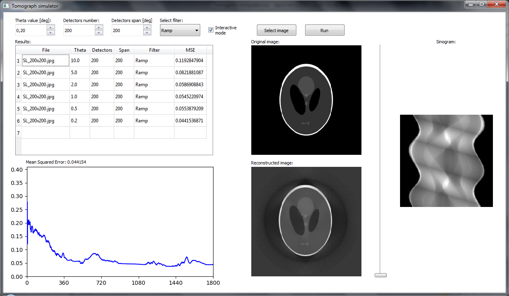
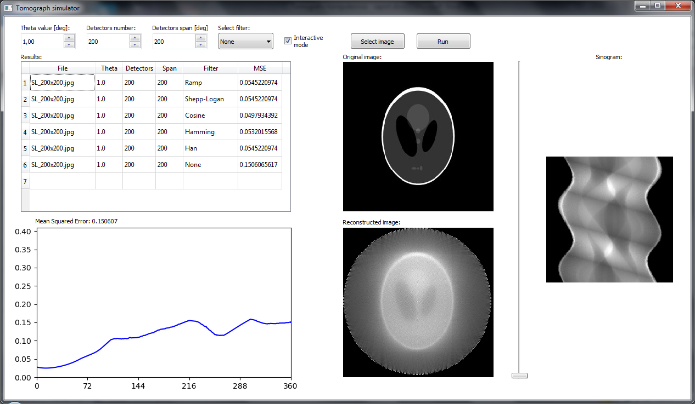
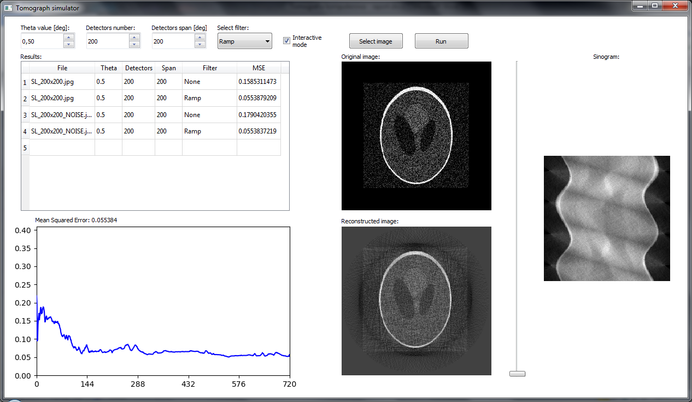
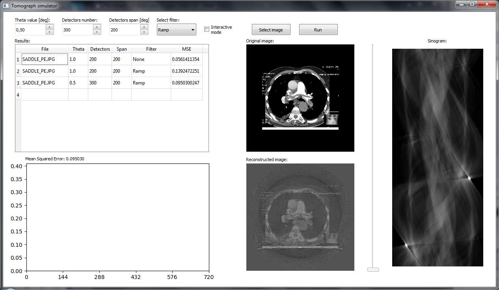
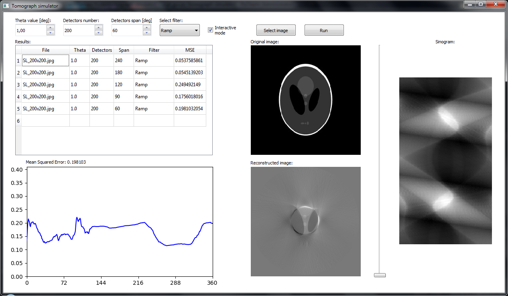

# Tomograph Image Reconstruction

University project for "IT in Medical Science". Image reconstruction using Radon transform and filtered backprojection based on computed tomography principles. Written in Python 3 using matplotlib and numpy packages.

## Configuration

| Parameter | Description |
| --- | --- |
| image | Image to reconstruct |
| theta | Emitter angle step |
| detectors_quantity | Number of detectors |
| span | Detectors span |
| filter_type | Type of used filter |

## Screenshots

